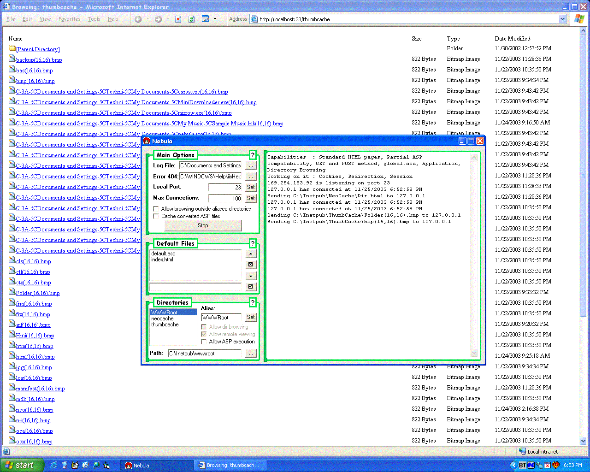



## Nebula Web Server

### Description

Acts as an ASP web server similar to IIS where you can alias multiple directories. Certain things are incomplete (Like locking out remote viewers) but will be added later. Just wanted to get some bug reports/help
 
### More Info
 
Requires MS Script Control

             |
---                |---
**Submitted On**   |2003-11-25 19:08:48
**By**             |[Techni Rei Myoko](https://github.com/Planet-Source-Code/PSCIndex/blob/master/ByAuthor/techni-rei-myoko.md)
**Level**          |Advanced
**User Rating**    |4.7 (14 globes from 3 users)
**Compatibility**  |VB 6\.0
**Category**       |[Internet/ HTML](https://github.com/Planet-Source-Code/PSCIndex/blob/master/ByCategory/internet-html__1-34.md)
**World**          |[Visual Basic](https://github.com/Planet-Source-Code/PSCIndex/blob/master/ByWorld/visual-basic.md)
**Archive File**   |[Nebula\_Web16762111252003\.zip](https://github.com/Planet-Source-Code/techni-rei-myoko-nebula-web-server__1-50125/archive/master.zip)

### API Declarations

Lots

